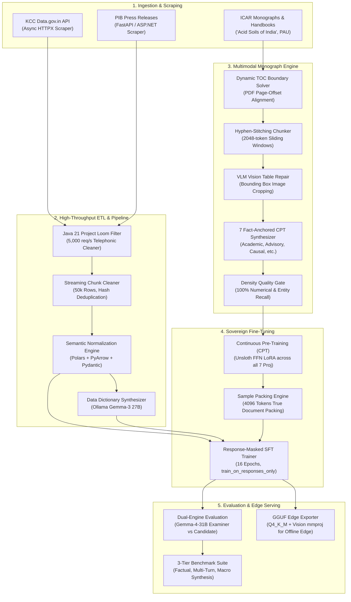

# 🌱 Agri-LM: Sovereign Multimodal Agricultural AI Ecosystem

[](https://www.python.org/downloads/)
[](https://pytorch.org/)
[](https://github.com/unslothai/unsloth)
[](https://huggingface.co/google/gemma-4-e2b-it)
[](https://openjdk.org/projects/loom/)
[](LICENSE)

**Agri-LM** is an end-to-end, domain-adapted sovereign AI ecosystem engineered specifically for Indian agronomic advisory, pedological diagnosis, and government policy retrieval across diverse agroclimatic zones.

By pairing high-throughput telephonic ETL with vision-language tabular reconstruction and continuous pre-training (CPT) over institutional monographs, Agri-LM bridges the divide between colloquial farmer queries and rigorous pedological science.

---

## 📌 Executive Problem & The 3 Critical Failures of Generic LLMs

Generic foundation models (GPT-4o, Gemma, Llama-3) exhibit severe catastrophic failure modes when applied to Indian agricultural extension:

```
+-----------------------------------------------------------------------------------------------+
|                                  THE 3 CRITICAL LLM FAILURES IN AGRICULTURE                   |
+------------------------------------+-----------------------------------+----------------------+
| 1. THE TABULAR HALLUCINATION TRAP   | 2. DIALECT VS TAXONOMIC GAP       | 3. ATTENTION BLIND   |
| Standard PDF OCR flattens chemical | Farmer voice queries mix regional | Factual thresholds   |
| & dosage tables into broken text,  | vernacular (e.g., 'makki',        | (e.g., pH < 4.5,     |
| causing models to invent lime      | 'bhutte') and operator noise,     | ZnSO4 dosages) fade  |
| dosages or output placeholders.    | fracturing tokenizers.            | under standard Q/K/V |
|                                    |                                   | attention tuning.    |
+------------------------------------+-----------------------------------+----------------------+
|                             AGRI-LM 5-PILLAR ARCHITECTURAL SOLUTION                           |
+------------------------------------+-----------------------------------+----------------------+
| VLM-Guided Table Repair:           | Java 21 Loom & PyArrow ETL:       | Unsloth FFN LoRA &   |
| Recovers tabular factual accuracy  | Sanitizes and normalizes millions | 7-Representation CPT:|
| from 0.0% -> 83.33%.               | of telephonic KCC dialogues.      | Locks dense facts    |
|                                    |                                   | into MLP parameters. |
+------------------------------------+-----------------------------------+----------------------+
```

---

## 🏛️ End-to-End System Topology



---

## 📊 Empirical Benchmarks & Validation Results

Evaluated via our dual-engine testing harness (`Gemma-4-31B-FP8` judge vs. candidate model across 150 standardized agronomic benchmark tasks):

### 1. Factual Retention & Examination Efficacy
| Model Variant / Epoch Stage | Stage 1 Factual Retention | Stage 2 Diagnostic Probe | Stage 3 Macro Synthesis | Overall Domain Index |
| :--- | :---: | :---: | :---: | :---: |
| **Gemma-4-E2B Base (Zero-Shot)** | 28.80% | 22.40% | 19.50% | 23.57% |
| **CPT Alone (Epoch 2)** | 42.10% | 36.80% | 31.20% | 36.70% |
| **CPT + SFT (Epoch 4)** | 61.20% | 52.40% | 46.80% | 53.47% |
| **Agri-LM Final (v3.2 SFT 16-Epoch)** | **74.67%** | **45.33%** | **41.00%** | **53.65%** |

### 2. Vision-Language Table Repair Engine Impact (Monograph Chapter 3)
| Metric | Standard PDF Text Extraction | Agri-LM VLM Table Repair Engine | Absolute Gain |
| :--- | :---: | :---: | :---: |
| **Header Alignment Accuracy** | 16.67% | **100.00%** | **+83.33%** |
| **Dosage Numerical Fidelity** | 0.00% | **83.33%** | **+83.33%** |
| **Pedological Formula Retention** | 25.00% | **91.67%** | **+66.67%** |

---

## 🗂️ Repository Structure

```
agri-lm/
├── README.md                          # Master ecosystem architecture (this file)
├── book-extraction/                   # Multimodal monograph & textbook extraction engine
│   ├── README.md                      # Detailed book extraction documentation
│   ├── main.py                        # 5-stage centralized pipeline orchestrator
│   ├── chunker.py                     # Sliding window hyphen-stitching text chunker
│   ├── toc_detector.py                # Automated TOC boundary and page range detector
│   ├── toc_extractor.py               # External TOC JSON solver & offset mapper
│   ├── table_repair.py                # VLM visual tabular reconstruction engine
│   ├── cpt_generator.py               # 7-representation async synthetic CPT generator
│   ├── cpt_formatter.py               # Document packing & token formatting utility
│   ├── density_validator.py           # Numerical anchor & entity quality gate
│   └── unit_test/                     # Pytest automated test suite
├── kcc-pipeline/                      # High-throughput Kisan Call Center ETL pipeline
│   ├── README.md                      # Master KCC pipeline orchestrator documentation
│   ├── downloader/                    # Asynchronous resumable Data.gov.in API scraper
│   ├── java-filter/                   # Java 21 Loom virtual threads telephonic noise filter
│   ├── cleaning/                      # 50k streaming chunk CSV cleaner & deduplicator
│   ├── normalization/                 # Semantic Polars & PyArrow taxonomy normalizer
│   ├── data-dictionary/               # Gemma-3 Ollama-driven schema catalog generator
│   └── generation/                    # Async vLLM FP8 teacher multi-turn dialogue synthesizer
├── finetuning/                        # Sovereign model training suite
│   ├── README.md                      # Unsloth CPT & response-masked SFT guide
│   ├── unsloth_cpt_trainer.py         # Full 7-projection FFN LoRA CPT trainer
│   ├── unsloth_sft_trainer.py         # Response-only loss masked SFT trainer
│   ├── configs/                       # Hyperparameter YAML definitions (CPT & SFT)
│   └── src/                           # Custom training datasets, models, and mergers
├── evaluation/                        # Automated validation & GGUF export harness
│   ├── README.md                      # Dual-engine evaluation & edge quantization guide
│   ├── eval_cpt_ollama_vllm.py        # 3-tier LLM-as-examiner validation harness
│   └── export_gguf.py                 # Fused 16-bit LoRA to GGUF & SigLIP vision exporter
└── web-scrapping/                     # Real-time policy & bulletin harvest engine
    ├── README.md                      # Web scraping architecture overview
    ├── kcc/                           # FastAPI producer-consumer Data.gov.in scraper
    └── pib/                           # FastAPI PIB Press Release & Cabinet decision scraper
```

---

## ⚡ Quickstart: End-to-End Execution Workflow

Agri-LM is designed with strict modular isolation: each subpackage maintains its own dedicated virtual environment (`venv/`) and `requirements.txt` to eliminate cross-library CUDA, PyTorch, Polars, and scraping runtime collisions.

```bash
# Clone the repository
git clone https://github.com/basava-code/agri-lm.git
cd agri-lm
```

### 1. Real-Time Web Scraping & Policy Harvesting (`web-scrapping/`)

```bash
# A. Harvest Ministry of Agriculture press releases & MSP declarations
cd web-scrapping/pib
python3 -m venv venv && source venv/bin/activate
pip install -r requirements.txt

# Start FastAPI scraping daemon
python scrapper.py &

# Trigger date-range scrape via REST endpoint
curl -X GET "http://localhost:8000/scrape-range?ministry=Ministry%20of%20Agriculture%20%26%20Farmers%20Welfare&start_date=01-01-2025&end_date=31-12-2025"
deactivate

# B. Run high-throughput Producer-Consumer KCC Harvester
cd ../kcc
python3 -m venv venv && source venv/bin/activate
pip install -r requirements.txt
python kcc_scrapper.py
deactivate
```

### 2. KCC High-Throughput Data Engineering Pipeline (`kcc-pipeline/`)

```bash
# Step 2.1: Download monthly KCC batches from Data.gov.in (resumable)
cd ../../kcc-pipeline/downloader
python3 -m venv venv && source venv/bin/activate
pip install -r requirements.txt
python cli.py
deactivate

# Step 2.2: Filter telephonic noise at scale with Java 21 Virtual Threads (Loom)
cd ../java-filter
mvn clean package -DskipTests
java -jar target/java-filter-1.0-SNAPSHOT.jar \
    --input ../downloader/data/csv/ \
    --output ../../data/filtered/ \
    --concurrency 5000

# Step 2.3: Stream clean in 50,000-row chunks with 64-bit query deduplication
cd ../cleaning
python3 -m venv venv && source venv/bin/activate
pip install -r requirements.txt
python cleaner.py \
    --input-dir ../../data/filtered/ \
    --output-dir ../../data/cleaned/ \
    --chunk-size 50000
deactivate

# Step 2.4: Discover emerging vernacular taxonomy with Ollama Gemma-3 27B
cd ../data-dictionary
python3 -m venv venv && source venv/bin/activate
pip install -r requirements.txt
python pipeline.py \
    --data-dir ../../data/cleaned/ \
    --config ../normalization/config.json \
    --output ../normalization/config.json \
    --model gemma3:27b
deactivate

# Step 2.5: Normalize dialect terms to Parquet using Polars lazy frames
cd ../normalization
python3 -m venv venv && source venv/bin/activate
pip install -r requirements.txt
python dataset_normalizer.py \
    --input ../../data/cleaned/cleaned_records.csv \
    --output ../../data/normalized/ \
    --config config.json
deactivate

# Step 2.6: Synthesize multi-turn farmer-expert dialogues with vLLM FP8 teacher
cd ../generation
python3 -m venv venv && source venv/bin/activate
pip install -r requirements.txt
python generate_data_vllm.py
python clean_duplicates.py --input-dir prepared_data/ --output-dir ../../data/processed/dialogues/
python validate_data.py --input-dir ../../data/processed/dialogues/
deactivate
```

### 3. Monograph Ingestion & Tabular Extraction (`book-extraction/`)

```bash
cd ../../book-extraction
python3 -m venv venv && source venv/bin/activate
pip install -r requirements.txt

# Run complete 5-stage automated pipeline on an institutional PDF
python main.py \
    --pdf "/path/to/Acid Soils of India.pdf" \
    --actual-pages 200 \
    --provider ollama \
    --model gemma3:27b

# Run table repair independently on noisy OCR extracts (surges accuracy from 0.0% -> 83.33%)
python table_repair.py \
    --input-dir extracted_chunks/ \
    --output-dir repaired_chunks/ \
    --vlm-model gemma-4-e2b-it

# Synthesize 7 fact-anchored CPT representations and validate through density gate
python cpt_generator.py --input-dir repaired_chunks/ --output-file ../data/processed/cpt_dataset.jsonl
python density_validator.py --source-dir repaired_chunks/ --generated-file ../data/processed/cpt_dataset.jsonl
deactivate
```

### 4. Continuous Pre-Training (CPT) with Unsloth (`finetuning/`)

```bash
cd ../finetuning
python3 -m venv venv && source venv/bin/activate
pip install -r requirements.txt

# Train 16-bit LoRA targeting all 7 linear projections with true document packing
python unsloth_cpt_trainer.py \
    --model_name unsloth/gemma-4-e2b-it \
    --dataset_path "../data/processed/cpt_dataset_packed.jsonl" \
    --output_dir outputs/cpt/agri_lm_cpt_v1 \
    --merged_dir outputs/cpt/agri_lm_cpt_v1_merged \
    --epochs 2 \
    --rank 64 \
    --max_seq_length 4096
```

### 5. Response-Masked Supervised Fine-Tuning (SFT) (`finetuning/`)

```bash
# Using the active finetuning virtual environment:
# Train assistant turns strictly on synthesized dialogues (answer loss masking)
python unsloth_sft_trainer.py \
    --model_name outputs/cpt/agri_lm_cpt_v1_merged \
    --dataset_path "../data/processed/dialogues/kcc_sft_dataset.jsonl" \
    --output_dir outputs/sft/agri_lm_sft_v1 \
    --epochs 4 \
    --learning_rate 2e-4 \
    --rank 32

# Merge LoRA adapters into standalone 16-bit weights
python src/merger.py \
    --base-model unsloth/gemma-4-e2b-it \
    --adapter-path outputs/sft/agri_lm_sft_v1 \
    --output-dir outputs/sft/agri_lm_sft_v1_merged
deactivate
```

### 6. Automated Dual-Engine Evaluation & GGUF Quantization (`evaluation/`)

```bash
cd ../evaluation
python3 -m venv venv && source venv/bin/activate
pip install -r requirements.txt

# Run 3-tier benchmark against examiner LLM (Gemma-4-31B on vLLM vs Candidate on Ollama)
python eval_cpt_ollama_vllm.py \
    --ollama_model gemma4_e2b_acid_soils_v3.2:f16 \
    --vllm_url http://localhost:8000/v1 \
    --vllm_model google/gemma-4-31b-it

# Export to quantized GGUF & patch SigLIP vision projector for rural edge deployment
python export_gguf.py
deactivate
```

---

## 💻 Hardware Requirements

| Stage | Minimum Configuration | Recommended Production Setup |
| :--- | :--- | :--- |
| **Data Cleaning & Loom** | 8-core CPU, 16 GB RAM | 32-core CPU, 64 GB RAM |
| **VLM Table Repair** | 1x NVIDIA RTX 3090 / 4090 (24 GB) | 1x NVIDIA A100 / H100 (80 GB) |
| **Unsloth CPT & SFT** | 1x NVIDIA A10G / RTX 4090 (24 GB) | 1x NVIDIA H100 / DGX Station (80 GB) |
| **GGUF Edge Inference** | 4-core Raspberry Pi 5 (8 GB RAM) | Jetson Orin Nano / Smartphone (Snapdragon 8 Gen 3) |

---

## 📜 License & Citation

This project is licensed under the Apache 2.0 License. If you use Agri-LM, its datasets, or extraction methodologies in your research or production pipelines, please cite:

```bibtex
@software{agri_lm_2026,
  author = {Agri-LM Core Team},
  title = {Agri-LM: Sovereign Multimodal Agricultural AI Ecosystem for Indian Agroclimatic Zones},
  year = {2026},
  url = {https://github.com/basava-code/agri-lm}
}
```
