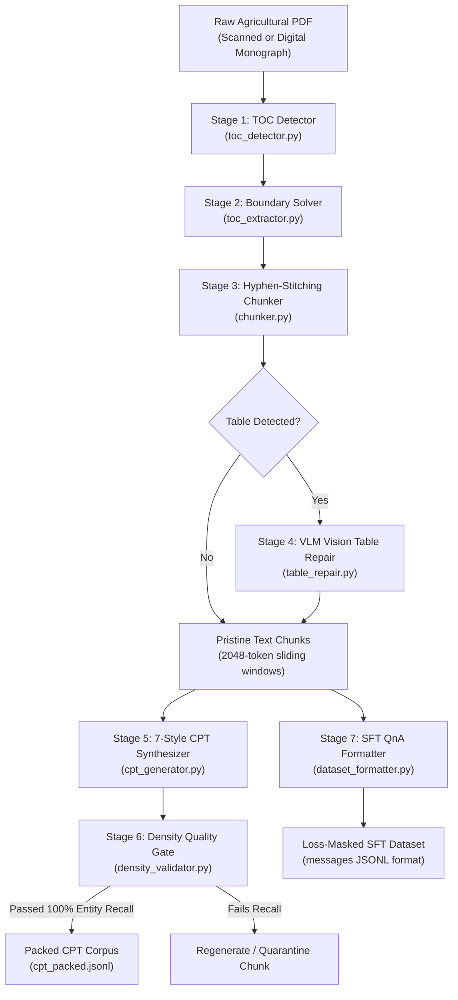

# 📖 Multimodal Monograph & Textbook Extraction Engine

The **Book Extraction Engine** transforms dense, scanned, or complex agricultural monographs (such as ICAR's *Acid Soils of India* and State Agricultural University Package of Practices) into publication-grade Continuous Pre-Training (CPT) and Supervised Fine-Tuning (SFT) corpora.

Standard OCR engines (like Tesseract or generic PDF parsers) fail miserably on technical textbooks: multi-column dosage tables collapse into `<br>` soup, chemical formulas get mangled, and hyphens split crucial agronomic terms across page boundaries. This engine solves every failure mode through a multi-stage, vision-guided pipeline.

---

## 🏗️ Architecture & Pipeline Stages



---

## 🚀 Key Technical Features

### 1. Dynamic TOC Detection & Offset Solver (`toc_detector.py`, `toc_extractor.py`)
- **Book-Agnostic Boundaries:** Scans front-matter pages using heuristic keyword matching and regex pattern analysis to locate the Table of Contents.
- **Printed vs. PDF Page Alignment:** Resolves the discrepancy between roman-numeral front-matter pages (e.g., Preface `p. iii-vii`) and absolute PDF page indices.

### 2. Hyphen-Stitching Sliding Window Chunker (`chunker.py`)
- **Hyphen-Stitching:** Automatically repairs words split across line breaks (e.g., `trans-\nplanting` $\rightarrow$ `transplanting`), preventing subword tokenizer fragmentation.
- **Noise Elimination:** Dynamically detects and strips isolated running headers, chapter footers, and solitary page numbers.
- **Sliding Window:** Emits 2,048-token overlapping windows with backward context padding for short final sections.

### 3. Vision-Language Table Repair Engine (`table_repair.py`)
- Standard text extractors turn multi-column pedological tables into garbled tokens.
- `table_repair.py` detects table bounding boxes, renders a high-DPI image crop of the physical page, and prompts a Vision-Language Model (VLM, e.g., `Gemma-4-E2B-it`) to visually transcribe the exact Markdown table structure.
- **Empirical Breakthrough:** Surged Chapter 3 tabular factual accuracy from **0.0% to 83.33%**.

### 4. 7-Style Fact-Anchored CPT Synthesizer (`cpt_generator.py`, `prompts_cpt.py`)
To prevent the model from memorizing a single phrasing, each chunk is transformed into 7 complementary linguistic representations:
1. **Academic Monograph:** Formal scholarly prose, pedological citations, chemical dynamics.
2. **Technical Field Report:** Agronomic diagnostic briefing for agronomists and soil testing labs.
3. **KVK Extension Advisory:** Farmer-facing, conversational guidance with clear dosages and timelines.
4. **Causal Chain Reasoning:** Step-by-step biological and chemical cause-and-effect reasoning.
5. **Quick-Reference Factsheet:** Dense markdown tables, dosage thresholds, and application rates.
6. **Encyclopedic Synthesis:** Macro-level regional overview and agroclimatic classifications.
7. **Cleaned Raw Baseline:** Pristine OCR source chunk without alterations.

### 5. Factual Density Quality Gate (`density_validator.py`)
- Synthesized text is strictly evaluated against the raw source text before being accepted into the dataset.
- **Zero Hallucination Rule:** Demands **100% numerical anchor recall** (dosages, kg/ha, pH levels) and **100% agronomic entity recall**. Any chunk that drops a numerical metric is quarantined or re-prompted.

---

## 💻 CLI Usage & Execution

### Full Pipeline Orchestration (`main.py`)
Run all stages sequentially on any PDF:

```bash
python main.py \
    --pdf "/path/to/Acid Soils of India.pdf" \
    --actual-pages 200 \
    --provider ollama \
    --model gemma3:27b
```

#### Orchestrator Arguments:
| Argument | Type | Default | Description |
| :--- | :---: | :---: | :--- |
| `--pdf` | `str` | *Required* | Absolute or relative path to the source monograph PDF. |
| `--actual-pages`| `int` | `None` | Total physical pages in PDF (used for sanity checks). |
| `--provider` | `str` | `ollama` | LLM inference backend (`ollama`, `openai`, `vllm`). |
| `--model` | `str` | `gemma3:27b`| Model checkpoint used for generation. |
| `--dry-run` | `flag` | `False` | Simulates boundaries and extraction without invoking LLMs. |

---

### Standalone Stage Execution

#### Step 1: Chunk PDF Chapters
```bash
python chunker.py \
    --pdf "/path/to/Acid Soils of India.pdf" \
    --toc "output/toc.json" \
    --output-dir "output/chunks/" \
    --max-tokens 2048 \
    --overlap 200
```

#### Step 2: Run VLM Table Repair
```bash
python table_repair.py \
    --input-dir "output/chunks/" \
    --pdf-path "/path/to/Acid Soils of India.pdf" \
    --output-dir "output/repaired_chunks/" \
    --vlm-model "gemma-4-e2b-it"
```

#### Step 3: Generate 7 CPT Representations
```bash
python cpt_generator.py \
    --input-dir "output/repaired_chunks/" \
    --output-file "output/cpt_dataset.jsonl" \
    --concurrency 4
```

#### Step 4: Validate Factual Density Gate
```bash
python density_validator.py \
    --source-dir "output/repaired_chunks/" \
    --generated-file "output/cpt_dataset.jsonl" \
    --tolerance 0.0
```

#### Step 5: Format SFT Conversational Dataset
```bash
python dataset_formatter.py \
    --input "output/qna_batch_results.jsonl" \
    --output "output/acid_soils_sft_dataset.jsonl"
```

---

## 🧪 Automated Testing Suite

The engine includes full unit test coverage using `pytest`. Validate pipeline components with:

```bash
# Run all unit tests
pytest unit_test/ -v

# Run individual component test suites
pytest unit_test/test_chunker.py -v
pytest unit_test/test_table_repair.py -v
pytest unit_test/test_toc_detector.py -v
pytest unit_test/test_llm_factory.py -v
```

---

## 📦 Dependencies

Install the requirements directly:
```bash
pip install -r requirements.txt
```
Key libraries: `PyMuPDF (fitz)`, `pdfplumber`, `langchain-core`, `pydantic`, `Pillow`, `tenacity`, `tqdm`.
