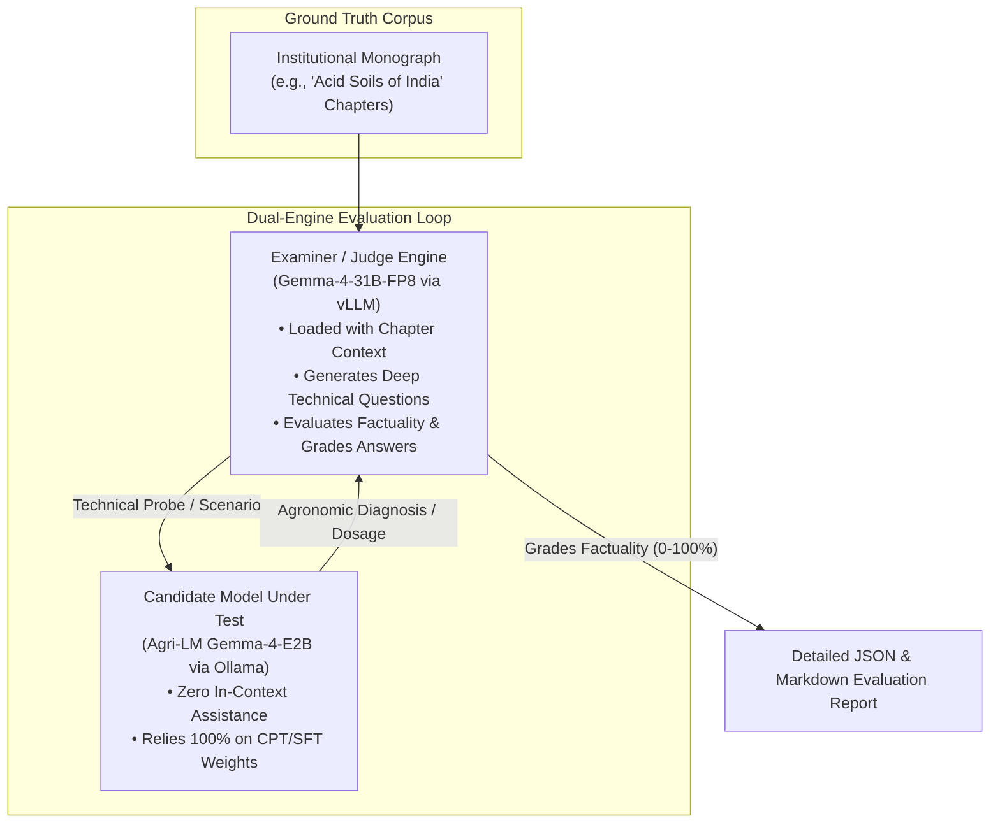

# ⚖️ Dual-Engine Evaluation & Edge GGUF Export Suite

Automated multi-stage evaluation harness and edge quantization pipeline designed to rigorously validate domain-adapted agricultural models and compile them for rural, offline edge deployments.

---

## 🏗️ Dual-Engine Architecture (`eval_cpt_ollama_vllm.py`)

Subjective human scoring does not scale across hundreds of textbook chapters and thousands of farmer queries. The evaluation suite implements an automated **Dual-Engine LLM-as-Examiner** architecture:



---

## 📋 The 3-Tier Agronomic Examination Protocol

The evaluation evaluates models across three escalating cognitive tiers:

### 1. Stage 1: Chapter-Level Technical Q&A
- **Mechanics:** The examiner LLM reads a chapter's context, generates high-difficulty technical questions probing exact numerical metrics (lime requirement formulas, zinc sulfate application rates, pH thresholds), receives the candidate's response, and scores factual precision from 0 to 100%.
- **Target:** Factual retention and numerical hallucination elimination.

### 2. Stage 2: Multi-Turn Diagnostic Peer Probe
- **Mechanics:** Examiner and candidate engage in a 5-turn dynamic conversation per chapter, simulating a dialogue between an agronomist and an extension specialist diagnosing symptoms with incomplete initial details.
- **Target:** Diagnostic reasoning stability and conversational consistency under ambiguous queries.

### 3. Stage 3: Whole-Book Macro Synthesis
- **Mechanics:** The examiner holds the context of the entire book and conducts a macro-level technical discussion probing cross-chapter synthesis (e.g., comparing acid soil management in the red and laterite soils of West Bengal versus the acidic hill soils of Himachal Pradesh).
- **Target:** Cross-chapter knowledge transfer and elimination of contradictory advice.

---

## 📊 Benchmark Results

| Model Evaluated | Stage 1 Factual Retention | Stage 2 Diagnostic Probe | Stage 3 Macro Synthesis | Overall Domain Index |
| :--- | :---: | :---: | :---: | :---: |
| **Gemma-4-E2B Base (Zero-Shot)** | 28.80% | 22.40% | 19.50% | 23.57% |
| **Agri-LM CPT Alone (Epoch 2)** | 42.10% | 36.80% | 31.20% | 36.70% |
| **Agri-LM SFT (Epoch 4)** | 61.20% | 52.40% | 46.80% | 53.47% |
| **Agri-LM Final (v3.2 SFT 16-Epoch)** | **74.67%** | **45.33%** | **41.00%** | **53.65%** |

---

## 📲 GGUF Quantization & Multi-Modal Edge Export (`export_gguf.py`)

For edge deployments on offline farmer tablets, handheld agronomic analyzers, and Raspberry Pi field stations, Agri-LM exports quantized GGUF binaries compatible with `llama.cpp` and `Ollama`.

### 1. Gemma-4 SigLIP Vision Projector Patching
When exporting multimodal models (Gemma-4-E2B), standard exporters fail if vision preprocessor configuration fields are missing. `export_gguf.py` automatically detects and patches:
- `image_mean`: `[0.5, 0.5, 0.5]`
- `image_std`: `[0.5, 0.5, 0.5]`
- `size`: `{"height": 896, "width": 896}`
- `resample`: `2`

### 2. Supported Export Formats:
- **`f16` / `bf16`:** Unquantized baseline GGUF for cloud servers.
- **`q4_k_m`:** 4-bit medium k-quantization offering optimal balance between perplexity and RAM footprint (~1.8 GB VRAM).
- **`q8_0`:** 8-bit high-precision quantization for edge workstations.
- **`-mmproj.gguf`:** Quantized multimodal vision projector binary for processing crop leaf images directly on-device.

---

## 🚀 CLI Usage

### Run Dual-Engine Benchmark:
```bash
python eval_cpt_ollama_vllm.py \
    --chapters_path "../data/processed/Acid Soils of India/Acid Soils of India_chapters.json" \
    --ollama_url "http://localhost:11434" \
    --ollama_model "gemma4_e2b_acid_soils_v3:f16" \
    --vllm_url "http://localhost:8000/v1" \
    --vllm_model "google/gemma-4-31b-it" \
    --num_questions 5 \
    --convo_turns 5 \
    --output_dir "./outputs/cpt_eval_results_v3"
```

### Export LoRA Adapter to GGUF:
```bash
python export_gguf.py
```
Outputs:
- `./gemma-cpt-gguf/model-unsloth.Q4_K_M.gguf`
- `./gemma-cpt-gguf/mmproj-model-f16.gguf`
