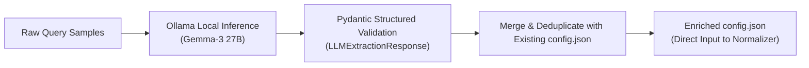

# 📚 AI-Assisted Taxonomic Data Dictionary Generator

An automated schema discovery and vernacular mapping pipeline powered by local LLMs (via Ollama, e.g., `Gemma-3-27B`). Analyzes raw conversational agricultural queries to discover colloquial prefixes, misspelled crop names, regional pests, and government schemes, enriching the normalizer's taxonomy catalog.

---

## 🎯 The Cold-Start Problem in Agricultural NLP

In Indian agriculture, farmers invent colloquial descriptions for emerging plant diseases, mix phonetically transcribed English trade names with local dialects, and use state-specific colloquialisms. Manually writing regex rules for hundreds of crops across 28 states is intractable.

The **Data Dictionary Pipeline** samples untruncated query batches, queries a local reasoning model with Pydantic structured output formatting, and extracts:
1. **Generic Prefixes:** Conversational filler opening phrases to strip (*"kripya jankari dein"*, *"farmer wants to know"*).
2. **Canonical Term Replacements:** Localized nicknames mapped to formal botanical or entomological terms.

---

## ⚙️ Architecture & Pydantic Schema



The model emits structured JSON adhering to:
```python
class LLMExtractionResponse(BaseModel):
    prefixes: List[str]                  # E.g., ['kripya batayein', 'farmer asked']
    canonical_replacements: Dict[str, str] # E.g., {'makka': 'maize', 'safed makkhi': 'whitefly'}
```

---

## 🚀 CLI Usage

```bash
python pipeline.py \
    --data-dir ../../data/cleaned \
    --config ../normalization/config.json \
    --output ../normalization/config.json \
    --model gemma3:27b \
    --samples-per-batch 50
```

### Options:
- `--data-dir`: Directory containing cleaned CSV files to sample from.
- `--config`: Input `config.json` to load existing rules from.
- `--output`: Destination path to save the enriched configuration.
- `--model`: Ollama model tag (default: `gemma3:27b`).
- `--ollama-url`: Endpoint of Ollama daemon (default: `http://localhost:11434`).
