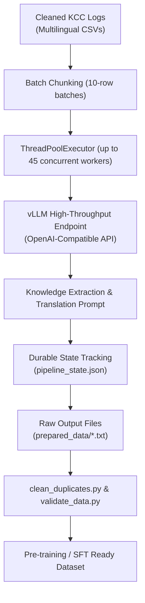

# ⚡ High-Throughput Synthetic Dialogue & CPT Generator (vLLM)

Asynchronous dataset synthesis pipeline utilizing local high-throughput **vLLM** inference servers (powered by `Gemma-4-31B-it` or teacher models) to transform multilingual, noisy farmer query logs into structured pedagogical textbook passages and instruction-tuning datasets.

---

## 🏗️ Architecture & Asynchronous Concurrency



---

## 🛠️ Components

### 1. Async Knowledge Synthesizer (`generate_data_vllm.py`)
- **Multilingual Knowledge Extraction:** Extracts core agronomic facts from diverse Indic scripts (Devanagari/Hindi, Gurmukhi/Punjabi, Kannada, Tamil, Marathi, Telugu) and Hinglish.
- **Translates & Formalizes:** Converts informal vernacular into formal, pedagogical English without conversational filler or operator greetings.
- **High Concurrency:** Dispatches parallel non-blocking requests (default: 45 concurrent workers) to saturate GPU tensor-parallel vLLM instances.
- **State Recovery:** Atomic progress logging in `pipeline_state.json` ensures zero data duplication upon restarts.

### 2. Post-Processing & Validation
- **`clean_duplicates.py`:** Evaluates semantic and string similarity across generated output files to eliminate redundant passages.
- **`validate_data.py`:** Validates token length distributions, schema completeness, and filters out `SKIP` flags emitted on non-informative batches.

---

## 🚀 Usage

### Prerequisites:
Ensure your local vLLM server is running the teacher model:
```bash
# Example vLLM server command
vllm serve google/gemma-4-31b-it \
    --port 8000 \
    --tensor-parallel-size 2 \
    --gpu-memory-utilization 0.90 \
    --max-model-len 8192
```

### Run Generation:
```bash
# Execute the generator
python generate_data_vllm.py

# Clean duplicates
python clean_duplicates.py --input-dir prepared_data/ --output-dir validated_data/

# Run validation suite
python validate_data.py --input-dir validated_data/
```

### Configuration:
Edit the top-level parameters in `generate_data_vllm.py`:
- `VLLM_BASE_URL`: Endpoint of the vLLM server (default: `http://localhost:8000/v1`).
- `BATCH_SIZE`: Number of KCC log entries batched per generation prompt (default: `10`).
- `MAX_WORKERS`: Number of concurrent asynchronous HTTP requests (default: `45`).
