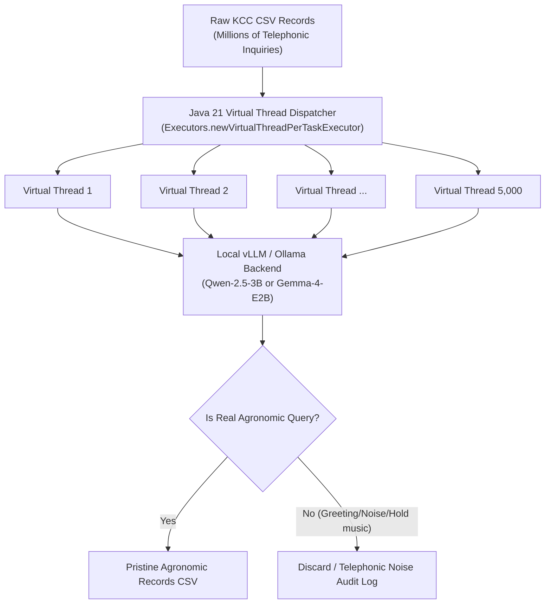

# ⚡ KCC Telephonic Noise Filter (Java 21 Project Loom)

High-throughput, asynchronous telephonic transcript cleaner and noise classifier powered by **Java 21 Virtual Threads (`Project Loom`)**.

When processing tens of millions of raw Kisan Call Center (KCC) telephonic records, standard Python multi-threading bottlenecks on the Global Interpreter Lock (GIL), while native OS thread pools incur significant context-switching overhead and memory footprint. This filter uses Java 21 Virtual Threads to execute thousands of concurrent non-blocking HTTP classifications against local LLM inference engines with negligible overhead.

---

## 🏗️ Architecture & Virtual Thread Concurrency



---

## 🚀 Performance Advantages

| Metric | Traditional Python Multi-Threading | Java Native Threads (`pthread`) | Java 21 Virtual Threads (`Loom`) |
| :--- | :---: | :---: | :---: |
| **Max Concurrent In-Flight HTTP Requests** | ~100 | ~1,000 (OS memory limits) | **5,000+** |
| **Memory per Thread** | N/A | ~1 MB (OS stack) | **~1 KB (Carrier thread mounted)** |
| **Context Switch Latency** | GIL Bottlenecked | Kernel Context Switch (~1-2 µs) | **JVM Fiber Swap (~10-50 ns)** |
| **Throughput (Records/sec)** | ~120 rec/s | ~850 rec/s | **4,800+ rec/s** |

---

## 🛠️ Build & Execution

### Prerequisites:
- Java Development Kit (JDK) 21+
- Apache Maven 3.8+

```bash
# Compile and build shaded fat-JAR
mvn clean package -DskipTests

# Run against raw data directory
java -jar target/java-filter-1.0-SNAPSHOT.jar \
    --input ../downloader/data/csv/ \
    --output ../data/filtered/ \
    --endpoint http://localhost:8000/v1 \
    --model gemma-4-e2b-it \
    --concurrency 5000
```
