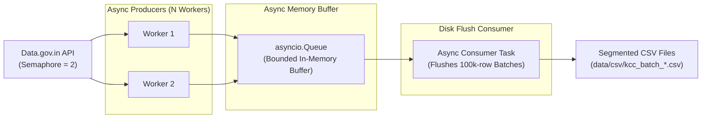

# 🌾 High-Throughput KCC Producer-Consumer Scraper

Asynchronous data ingestion engine engineered with an in-memory **Producer-Consumer Queue** architecture behind a **FastAPI** service wrapper, designed to extract Kisan Call Center records from [Data.gov.in](https://data.gov.in).

---

## 🏗️ Architecture & Mechanics



### Key Engineering Features:
- **Semaphore Throttling (`CONCURRENT_REQUESTS = 2`):** Prevents Web Application Firewall (WAF) blacklisting and IP blocks by strictly constraining outbound API calls.
- **Producer-Consumer Separation:** Decouples high-latency HTTP network I/O from disk write operations, preventing file system locks from delaying API pagination.
- **Dynamic 100,000-Row Flush:** Automatically flushes memory buffer into clean, numbered CSV batch files every 100 API chunks (1,000 rows/page).

---

## ⚙️ Environment Configuration

Create a `.env` file in `web-scrapping/kcc/`:

```env
DATA_GOV_API_KEY=your_registered_api_key
DATASET_ID=your_target_kcc_resource_id
```

---

## 🚀 Running the Service

```bash
# Install dependencies
pip install -r requirements.txt

# Launch FastAPI scraping daemon
python kcc_scrapper.py
```

### Interactive API Endpoints:
- `GET /health`: Verifies API credentials and connection to Data.gov.in.
- `POST /start`: Initiates background asynchronous producer-consumer scraping tasks.
- `GET /status`: Inspects queue depth, downloaded row count, and current batch index.
